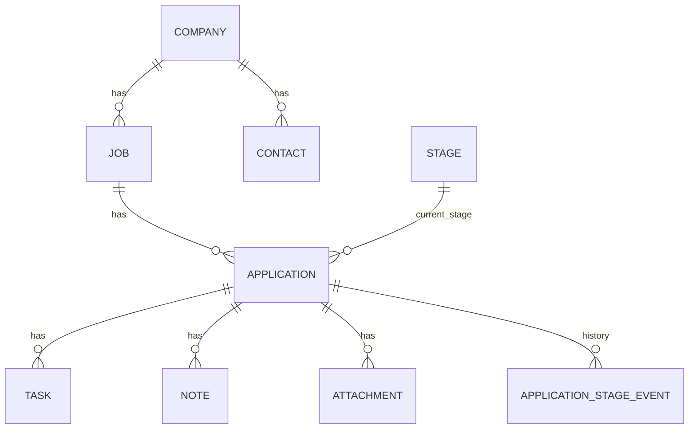

# Job Tracker App (Personal ATS)

A personal Applicant Tracking System (ATS) to track job applications, pipeline stages, contacts, tasks/reminders, notes, attachments, and analytics.
live-link:https://jobtrackerapp-abhee.streamlit.app/

## Features

- Single-user authentication (password in `.env`)
- CRUD: Companies, Jobs, Contacts, Applications, Stages, Tasks, Notes
- Kanban pipeline view (Applications by Stage)
- Task list + calendar-style upcoming view
- File uploads (resume/cover letter) linked to Applications
- Import/Export: CSV + JSON
- Analytics dashboards (apps/week, response rate, stage drop-offs, time-to-offer)
- Email reminders via SMTP (optional)

## Quickstart (Windows)

Create a virtualenv, install deps, run migrations, seed data, start the app:

```bash
python -m venv .venv
.venv\Scripts\activate
pip install -r requirements.txt
python -m job_tracker migrate
python -m job_tracker seed
python -m streamlit run app.py
```

Open the app and log in with the password you set in `.env`.

## Configuration

Create `.env` in the project root (you can copy from `.env.example`):

```bash
APP_PASSWORD=change-me
APP_SECRET_KEY=change-me-too
DB_URL=sqlite:///job_tracker.sqlite3

# Optional SMTP for reminders
SMTP_HOST=smtp.gmail.com
SMTP_PORT=587
SMTP_USERNAME=you@example.com
SMTP_PASSWORD=app-password
SMTP_FROM=Job Tracker <you@example.com>
REMINDER_TO=you@example.com
```

## Schema diagram



### Entities

- **Company**: target company
- **Job**: specific role posting under a company
- **Contact**: recruiter/hiring manager/network contact
- **Stage**: pipeline stage (Applied/Screen/Interview/Offer/…)
- **Application**: your application to a job, with current stage + follow-up fields
- **ApplicationStageEvent**: stage transition history (powers drop-offs + time-to-offer)
- **Task**: reminders & todos per application (supports snooze and basic recurring rules)
- **Note**: freeform notes per application
- **Attachment**: uploaded files (resume/cover letter/other) linked to an application

## Migrations

This project uses Alembic.

- Create/update DB schema:

```bash
python -m job_tracker migrate
```

## Reminders

If SMTP is configured, you can send reminders for due tasks:

```bash
python -m job_tracker send-reminders
```

## Chrome extension (bonus): capture postings

The capture API runs locally and writes into the **same SQLite DB** as Streamlit.

1. Set `CAPTURE_API_TOKEN` in `.env` (see `.env.example`).
2. Start the API (leave it running while you use the extension):

```bash
python -m job_tracker serve-capture
```

3. In Chrome: `chrome://extensions` → **Developer mode** → **Load unpacked** → select the `chrome-extension` folder.
4. Open the extension **Options** and paste the same token + API URL (`http://127.0.0.1:8765` by default).
5. On a job posting page, click the extension → **Send to Job Tracker** (saved under **Wishlist**).

Details: `chrome-extension/README.md`.

## Import / Export

- Export everything:

```bash
python -m job_tracker export --out-dir exports --json
```

- Import applications from CSV in the UI (template columns shown on the Import page).

## Deployment notes

Streamlit Cloud works best with Postgres, but this repo defaults to SQLite for local development. For deployment:

- Set `DB_URL` to Postgres (e.g., `postgresql+psycopg://...`)
- Add `psycopg` to requirements
- Configure secrets in the platform’s environment variables

## Demo video

Record a ≤3 min walkthrough:
- login
- create company/job/application
- move cards in kanban
- add tasks + show upcoming view
- upload resume/cover letter
- import/export
- show analytics

